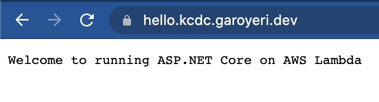

# Are you there .NET? It's me, AWS.

This project is a minimal .NET 5 ASP.NET Core web application that can be deployed on AWS as a Lambda or a Fargate container, or run locally.

## Building this repository from scratch

This set of commands will setup the solution, add the new projects, configure some sensible defaults, and open it up in Visual Studio Code. At this point, you could easily open it in any desired IDE: Visual Studio, Rider, Code, whatever.

```shell
dotnet new -i Amazon.Lambda.Templates

mkdir AwsHelloWorldWeb
cd AwsHelloWorldWeb
dotnet new gitignore
dotnet new tool-manifest
dotnet tool install amazon.lambda.tools
dotnet new sln
dotnet new serverless.image.AspNetCoreWebAPI HelloWeb
dotnet sln add src/**
dotnet sln add test/**
dotnet build
code .
```

At this point, you can run the web application like a normal ASP.NET Core application. Go ahead, try it!

After this point, I've made modifications, so if you want to see exactly what those changes were, you can check the difference between what you generate locally and what the code looks like.

## Create the Deployment Scripts with CDK

[AWS Cloud Development Kit (CDK)](https://aws.amazon.com/cdk/) is a deployment technology from AWS that makes it easier to build up CloudFormation templates for deploying your code. You write your declarative deployment structures in a comfortable language such as TypeScript, C#, Python, or Java instead of creating them directly in YAML. CDK has an opionated approach on deploying into AWS that sets up a reasonably happy path as long as you stay near it. It also has a CloudFormation escape hatch where you can manually create CloudFormation constructs or create your own higher level constructs to do things the way you want.

The following commands will generate the deployment project template:

```shell
mkdir deploy
cd deploy
npx aws-cdk@1.121.0 init app -l csharp
npm init -y
npm install aws-cdk@1.121.0 --save-exact
```

At this point, edit the `package.json` file to replace the `scripts` section to allow us to run the `cdk` tool. If you want, change the license as well. The whole file will look like this:

```json
{
  "name": "deploy",
  "version": "1.0.0",
  "description": "This is a blank project for C# development with CDK.",
  "main": "index.js",
  "scripts": {
    "cdk": "cdk"
  },
  "keywords": [],
  "author": "",
  "license": "MIT",
  "dependencies": {
    "aws-cdk": "1.121.0"
  }
}
```

Next we'll build the code and try out generating a blank AWS to make sure it works:

```shell
dotnet build src
npm run cdk -- synth
```

You should see some YAML that represents the minimal empty CDK configuration.

Let's also add this deployment project to the parent solution:

```shel
cd ..
dotnet sln add deploy/src/Deploy
dotnet build
```

### A disclaimer on CDK versioning

As you work with CDK, you'll pull new package references into your project to add support for other AWS services. Be very careful to keep the CDK version numbers exactly the same for all packages. The project file: `deploy/src/Deploy/Deploy.csproj` defines a property and a property group to make it easier to update all the versions if you decide to upgrade CDK to resolve issues or support newer services:

```xml
<Project Sdk="Microsoft.NET.Sdk">

  <PropertyGroup>
    <OutputType>Exe</OutputType>
    <TargetFramework>netcoreapp3.1</TargetFramework>
    <!-- Roll forward to future major versions of the netcoreapp as needed -->
    <RollForward>Major</RollForward>
  </PropertyGroup>

  <PropertyGroup>
    <CDKVersion>1.121.0</CDKVersion>
  </PropertyGroup>

  <ItemGroup>
    <!-- CDK Construct Library dependencies -->
    <PackageReference Include="Amazon.CDK" Version="$(CDKVersion)" />
    <PackageReference Include="Amazon.CDK.AWS.APIGatewayv2" Version="$(CDKVersion)" />
    <PackageReference Include="Amazon.CDK.AWS.APIGatewayv2.Integrations" Version="$(CDKVersion)" />
    <PackageReference Include="Amazon.CDK.AWS.ECR" Version="$(CDKVersion)" />
    <PackageReference Include="Amazon.CDK.AWS.CertificateManager" Version="$(CDKVersion)" />
    <PackageReference Include="Amazon.CDK.ECR.Assets" Version="$(CDKVersion)" />
    <PackageReference Include="Amazon.CDK.AWS.Lambda" Version="$(CDKVersion)" />
    <PackageReference Include="Amazon.CDK.AWS.Route53" Version="$(CDKVersion)" />
    <PackageReference Include="Amazon.CDK.AWS.Route53.Targets" Version="$(CDKVersion)" />

    <!-- jsii Roslyn analyzers (un-comment to obtain compile-time checks for missing required props -->
    <PackageReference Include="Amazon.Jsii.Analyzers" Version="*" PrivateAssets="all" />
  </ItemGroup>

</Project>
```

This way, you can update the `<CDKVersion>` element once to update all the package references and keep them in lock step.

There's little stopping you from staying with a particular version. CDK is based on CloudFormation whose template schema version is still dated `2010-09-09`. All the AWS services likewise tend to be very backwards compatible, so there's little chance of something suddenly completely stopping working. The only reason to upgrade would be to support bug fixes or if there's a new service or setting that is available only in new configuration schemas for those services.

## Setup AWS CLI

The rest of the instructions assume that you've got an AWS account setup already, you've setup a programmatic access user, and created a local CLI profile called `"personal`" with the access key an secret key.

## Deploying DNS

If you have a domain name handy, you can deploy a AWS Route53 Hosted Zone to provide "nice" domain names for your workshop items. In this case, we're using `kcdc.garoyeri.dev` as the subdomain root. Substitute your own domain name if you've got one.

```shell
cd deploy
dotnet build src
npm run cdk -- deploy DeployDnsStack --parameters DeployDnsStack:RootDomainName=kcdc.garoyeri.dev --profile personal
```

After the stack deploys (successfully), you'll see a list of outputs:

```
DeployDnsStack.HostedZoneArn = arn:aws:route53:::hostedzone/Z08450421CUAFXM0YLX6M
DeployDnsStack.HostedZoneId = Z08450421CUAFXM0YLX6M
DeployDnsStack.NameServers = ns-1484.awsdns-57.org,ns-1947.awsdns-51.co.uk,ns-952.awsdns-55.net,ns-64.awsdns-08.com
```

These will be used for setting up your DNS. Go to your DNS provider and add NS records for the desired subdomain. For example on the output above, you should add the following records to your DNS provider:

| Record Type | Record              | TTL    | Value                     |
| ----------- | ------------------- | ------ | ------------------------- |
| `NS`        | `kcdc.garoyeri.dev` | `3600` | `ns-1484.awsdns-57.org`   |
| `NS`        | `kcdc.garoyeri.dev` | `3600` | `ns-1947.awsdns-51.co.uk` |
| `NS`        | `kcdc.garoyeri.dev` | `3600` | `ns-952.awsdns-55.net`    |
| `NS`        | `kcdc.garoyeri.dev` | `3600` | `ns-64.awsdns-08.com`     |

Your DNS provider may represent these accounts in different ways. Usually you'll either see separate entries for each nameserver, or you'll see a single entry with 4 answers. In either case, the DNS entries will be 4 and look like the table above. You can start the TTL with 1 hour for now, then increase it later to 48 hours to reduce the amount of DNS traffic and improve caching.

At this point, your DNS subdomain (`kcdc.garoyeri.dev`) is deferring to AWS to provide information on any further subdomains (such as `hello.kcdc.garoyeri.dev`).

## Deploying the Hello World Web

Next, we'll deploy the Hello World Web. In the following command, replace `hello.kcdc.garoyeridev` with your own desired URL, and replace `Z07391151E50793DGWFJ0` with your own Root Hosted Zone ID from the previous stack deployment.

If you're not using a custom domain name, then you need to edit `Program.cs` and change the `skipCertificate: false` to `skipCertificate: true` on the  statement containing `new DeployLambdaStack`. Otherwise the deployment will fail trying to validate the certificate.

```shell
npm run cdk -- deploy DeployLambdaStack --parameters DeployLambdaStack:DomainName=hello --parameters DeployLambdaStack:RootHostedZoneId=Z07391151E50793DGWFJ0 --parameters DeployLambdaStack:RootHostedZoneName=kcdc.garoyeri.dev --profile personal
```

When you run this, it will ask you to confirm changes to IAM. These are the security settings that are created automatically by CDK when you link things together. It will configure the correct permissions for you automatically, but any changes to IAM will need to be reviewed on a deployment. If you redeploy and there are no IAM changes, then this confirmation will not appear.

The outputs will include a URL that can be used instead of the custom domain name you added. So if you chose not to apply a custom domain, then use this URL. For example:

```shell
Outputs:
DeployLambdaStack.ApiEndpoint = https://93v78n62g7.execute-api.us-east-1.amazonaws.com
```

If you decided to use a custom URL like mine (https://hello.kcdc.garoyeri.dev), then that's the base URL.

Let's try one and see what happens, point your browsers to: <https://hello.kcdc.garoyeri.dev> and see what happens.




